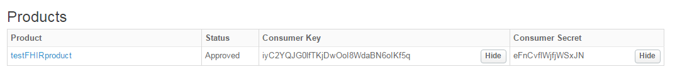

**Testing with POSTMAN- REST client**
-------------------------------------

FHIR APIs deployed can be tested through POSTMAN REST client for a B2B scenario.
For B2C scenario, use api docs from developer portal deployment.

Import **fhir-apis-collection.json** Postman collection for all APIs.

A reference environment configuration file, **env.json**, for POSTMAN to manage environment variables is also available. 
You can use this above postman environment configuration and replace values as per existing environment.

Testing a B2B (Business to Business) flow is explained as follows.

First get an access token. Go to **GenerateAccessToken-ClientCredOnly** collection.

Insert valid values at place holders , referring below, and get an access token.

**URL** : https://{OrgName}-{Environment}.apigee.net/oauth/v2/accesstoken?grant\_type=client\_credentials&scope={scope}

**Scope** : For any resource API, it should be "user/{resource}.read";

 for e.g. For Patient resource, it will be **user/Patient.read**

Complete List of yet supported scopes are as follows:

| **Scopes** |
| --- |
| user/Allergyintolerance.read |
| user/Careplan.read |
| user/Condition.read |
| user/Coverage.read |
| user/Diagnosticorder.read |
| user/Diagnosticreport.read |
| user/Documentreference.read |
| user/Encounter.read |
| user/Immunization.read |
| user/Medicationadministration.read |
| user/Medicationdispense.read |
| user/Medicationorder.read |
| user/Medicationstatement.read |
| user/Observation.read |
| user/Patient.read |
| user/Practitioner.read |
| user/Procedure.read |
| user/Schedule.read |

**Note** : For Basepath APIs, there is no need to add the scope query parameter.

**Verb** : POST

**Headers** : 'Authorization'  Basic {base64 conversion of consumer key and consumer secret for' testFHIRApp'}

Use tool for conversion ( [https://www.base64encode.org/](https://www.base64encode.org/) )

You will get the Consumer key and Consumer secret of 'testFHIRApp' from the Apigee Management interface under Publish->Apps

Refer the figure below.

  
Figure : Consumer key and consumer secret reference

 After getting an access token, you can access any FHIR resources by sending the token as a bearer token.

**Headers** : 'Authorization'  Bearer {access\_token}

The sequence of requests is kept as follows, to help running entire collection at once.

1. Generate access token request is placed on top to fetch access token for all resources. Scope query parameter is not used so that token with all scopes is generated for running entire collection at once. But scope can be used if access to specific resources is needed.

2. Search Resource request is placed on top for every resource in order to fetch id and vid dynamically from the 1st record entry.

Useful Notes:

1. By default, generate access token request retrieves token to read all FHIR resources. Use 'scope' query parameter to get token to access limited resources
2. You may choose to first execute Search Resource request which sets the postman global variables id and vid with value of first record from the response.
